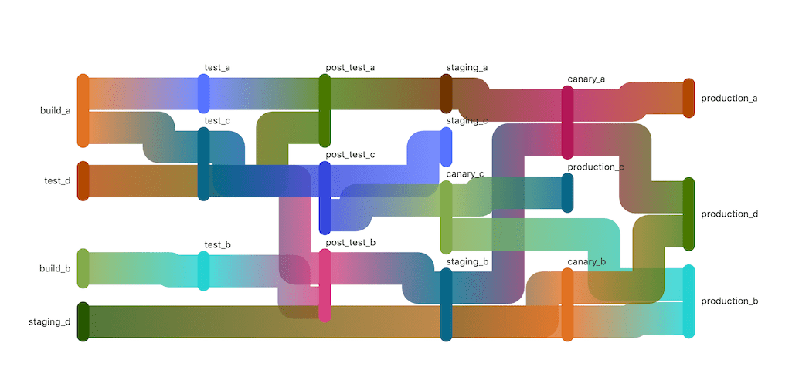
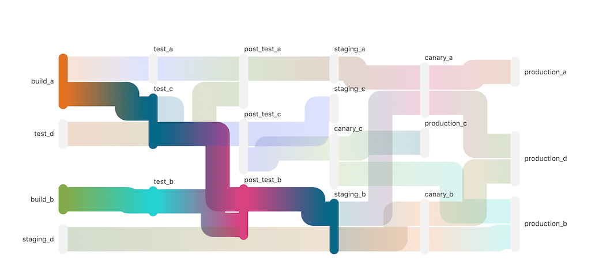

# Make jobs start earlier with `needs`

DETAILS:
**Tier:** Free, Premium, Ultimate
**Offering:** GitLab.com, Self-managed, GitLab Dedicated

You can use the [`needs`](../yaml/index.md#needs) keyword to create dependencies between jobs
in a pipeline. Jobs run as soon as their dependencies are met, regardless of the pipeline's `stages`
configuration. You can even configure a pipeline with no stages defined (effectively one large stage)
and jobs still run in the proper order. This pipeline structure is a kind of
[directed acyclic graph](https://en.wikipedia.org/wiki/Directed_acyclic_graph).

For example, you may have a specific tool or separate website that is built
as part of your main project. Using `needs`, you can specify dependencies between
these jobs and GitLab executes the jobs as soon as possible instead of waiting
for each stage to complete.

Unlike other solutions for CI/CD, GitLab does not require you to choose between staged
or stageless execution flow. You can implement a hybrid combination of staged and stageless
in a single pipeline, using only the `needs` keyword to enable the feature for any job.

Consider a monorepo as follows:

```plaintext
./service_a
./service_b
./service_c
./service_d
```

This project could have a pipeline organized into three stages:

| build     | test     | deploy |
|-----------|----------|--------|
| `build_a` | `test_a` | `deploy_a` |
| `build_b` | `test_b` | `deploy_b` |
| `build_c` | `test_c` | `deploy_c` |
| `build_d` | `test_d` | `deploy_d` |

You can improve job execution by using `needs` to relate the `a` jobs to each other
separately from the `b`, `c`, and `d` jobs. `build_a` could take a very long time to build,
but `test_b` doesn't need to wait, it can be configured to start as soon as `build_b` is finished,
which could be much faster.

If desired, `c` and `d` jobs can be left to run in stage sequence.

The `needs` keyword also works with the [parallel](../yaml/index.md#parallel) keyword,
giving you powerful options for parallelization in your pipeline.

## Use cases

You can use the [`needs`](../yaml/index.md#needs) keyword to define several different kinds of
dependencies between jobs in a CI/CD pipeline. You can set dependencies to fan in or out,
and even merge back together (diamond dependencies). These dependencies could be used for
pipelines that:

- Handle multi-platform builds.
- Have a complex web of dependencies like an operating system build.
- Have a deployment graph of independently deployable but related microservices.

Additionally, `needs` can help improve the overall speed of pipelines and provide fast feedback.
By creating dependencies that don't unnecessarily
block each other, your pipelines run as quickly as possible regardless of
pipeline stages, ensuring output (including errors) is available to developers
as quickly as possible.

<!--- start_remove The following content will be removed on remove_date: '2024-12-19' -->
## Needs dependency visualization (deprecated)

WARNING:
This feature was [deprecated](https://gitlab.com/gitlab-org/gitlab/-/issues/336560) in GitLab 17.1
and is planned for removal in 17.4. View `needs` relationships in the
[full pipeline graph](../pipelines/index.md#group-jobs-by-stage-or-needs-configuration) instead.

The needs dependency visualization makes it easier to visualize the dependencies
between jobs in a pipeline. This graph displays all the jobs in a pipeline
that need or are needed by other jobs. Jobs with no dependencies are not displayed in this view.

To see the needs visualization, select **Needs** when viewing a pipeline that uses the `needs` keyword.



Selecting a node highlights all the job paths it depends on.


<!--- end_remove -->
