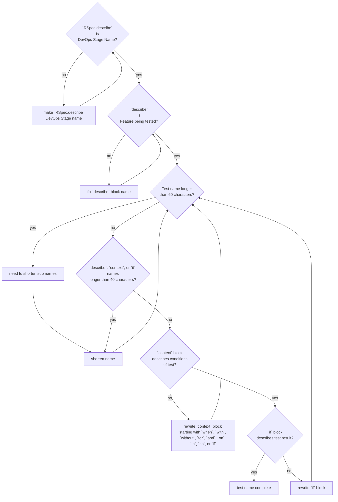

# Naming

Test names should form a readable sentence defining the purpose of the test. Our [testing guide](index.md) extends the [Thoughtbot testing style guide](https://github.com/thoughtbot/guides/tree/master/testing-rspec). This page clarifies the guidelines, along with input from [https://www.betterspecs.org/](https://www.betterspecs.org/) and [the RSpec naming guide](https://rspec.rubystyle.guide/#naming.)

## Recommended Approach

The following block generates a test named `Plan wiki content creation when inside a project successfully adds a home page`

``` ruby
# `RSpec.describe` is the DevOps Stage being covered 
RSpec.describe 'Plan', product_group: :knowledge do
  # `describe` is the feature being tested
  describe 'wiki content creation' do
    # `context` provides the condition being covered
    context 'when inside a project'
      # `it` defines the actual result of the test
      it 'successfully adds a home page'
      ...
      end
    ...
    end
  ...
  end
end
```


1. Every `describe`, `context`, and `it` blocks should have a short description attached
1. Keep individual description shorter than 40 characters.
    1. if it is longer or you have multiple conditionals, that is a sign it should be split up (additional `context` blocks)
    1. The full test name should be less than 60 characters
1. The outermost `Rspec.describe` block should be [the DevOps stage name](https://about.gitlab.com/handbook/product/categories/#devops-stages)
1. Inside that block is a `describe` block with the name of the feature being tested
1. Inside that block are `context` blocks with names that define what the conditions being tested are
    1. `context` blocks descriptions should begin with `when`, `with`, `without`, `for`, `and`, `on`, `in`, `as`, or `if` to match the [rubocop rule](https://www.rubydoc.info/gems/rubocop-rspec/RuboCop/Cop/RSpec/ContextWording)
    1. if the test is simple enough and does not need conditional blocks, `context` blocks may not be needed
1. the innermost is the `it` block with a name that defines the pass/fail criteria for the test
    1. A `specify` block can be used instead of a named `it` block if the test is simple enough

### Conventions flowchart


