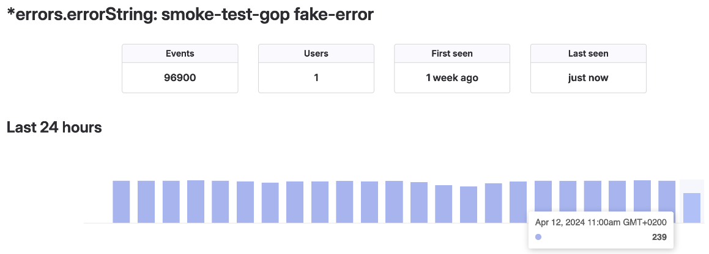

# Integrated error tracking

DETAILS:
**Tier:** Free, Premium, Ultimate
**Offering:** GitLab.com

This guide provides basic information on how to set up integrated error tracking for
your project, using examples from different languages.

Error tracking provided by GitLab Observability is based on
[Sentry SDK](https://docs.sentry.io/).
For more information and examples of how you can use Sentry SDK in your application,
see the [Sentry SDK documentation](https://docs.sentry.io/platforms/).

## Enable error tracking for a project

Regardless of the programming language you use, you first need to enable error tracking
for your GitLab project. This guide uses the `GitLab.com` instance.

Prerequisites:

- You must have a project for which you want to enable error tracking.
  See how to [create a project](../user/project/index.md).

To enable error tracking with GitLab as the backend:

1. On the left sidebar, select **Search or go to** and find your project.
1. Go to **Settings > Monitor**.
1. Expand **Error Tracking**.
1. For **Enable error tracking**, select **Active**.
1. For **Error tracking backend**, select **GitLab**.
1. Select **Save changes**.
1. Copy the **Data Source Name (DSN)** string. You need it to configure your SDK implementation.

## Configure user tracking

To track the number of users affected by an error:

- In the instrumentation code, ensure each user is uniquely identified.
  You can use a user ID, name, email address, or IP address to identify a user.

For example, if you use
[Python](https://docs.sentry.io/platforms/python/enriching-events/identify-user/),
you can identify a user by email:

```python
Sentry.setUser({ email: "john.doe@example.com" });
```

For more information about user identification, see the [Sentry documentation](https://docs.sentry.io/).

## View tracked errors

After your application emits errors to the Error Tracking API through the Sentry SDK,
those errors are available in the GitLab UI. To view them:

1. On the left sidebar, select **Search or go to** and find your project.
1. Go to **Monitor > Error Tracking** to see the list of open errors:

   

1. Select an error to see the **Error details** view:

   

   This page shows more details of the exception, including:

   - Total number of occurrences.
   - Total users affected.
   - First seen: the date and commit (**{commit}**).
   - Last seen date, shown as a relative date. To view the timestamp, hover over the date.
   - A bar graph of error frequency per hour. To view the total number of errors in a specific hour, hover over a bar.
   - A stack trace.

### Create an issue from an error

If you want to track work related to an error, you can create an issue directly from the error:

- From the **Error details** view, select **Create issue**.

An issue is created. The issue description contains the error stack trace.

### Analyze an error's details

To view the full timestamp of an error:

- On the **Error details** page, hover over to the **Last seen** date.

In the following example, the error happened at 11:41 CEST:


The **Last 24 hours** graph measures how many times this error occurred per hour.
By pointing at the `11 am` bar, the dialog shows the error was seen 239 times:



The **Last seen** field does not update until the full hour is complete, due to
the library used for the call
[`import * as timeago from 'timeago.js'`](https://gitlab.com/gitlab-org/gitlab/-/blob/master/app/assets/javascripts/lib/utils/datetime/timeago_utility.js#L1).

## Emit errors

### Supported language SDKs & Sentry types

GitLab Error Tracking supports these event types:

| Language | Tested SDK client and version   | Endpoint   | Supported item types              |
| -------- | ------------------------------- | ---------- | --------------------------------- |
| Go       | `sentry-go/0.20.0`              | `store`    | `exception`, `message`            |
| Java     | `sentry.java:6.18.1`            | `envelope` | `exception`, `message`            |
| NodeJS   | `sentry.javascript.node:7.38.0` | `envelope` | `exception`, `message`            |
| PHP      | `sentry.php/3.18.0`             | `store`    | `exception`, `message`            |
| Python   | `sentry.python/1.21.0`          | `envelope` | `exception`, `message`, `session` |
| Ruby     | `sentry.ruby:5.9.0`             | `envelope` | `exception`, `message`            |
| Rust     | `sentry.rust/0.31.0`            | `envelope` | `exception`, `message`, `session` |

For a detailed version of this table, see
[issue 1737](https://gitlab.com/gitlab-org/opstrace/opstrace/-/issues/1737).

See also working [examples for supported language SDKs](https://gitlab.com/gitlab-org/opstrace/opstrace/-/tree/main/test/sentry-sdk/testdata/supported-sdk-clients), showing how to capture exceptions, events, or messages with that SDK.
For more information, see the [Sentry SDK documentation](https://docs.sentry.io/) for a specific language.

## Rotate generated DSN

WARNING:
The Sentry DSN, also known as a client key, is a secret.
Don't expose it to the public. If it is leaked or exposed, rotate the Sentry DSN.

Prerequisites:

- You need the numeric [project ID](../user/project/working_with_projects.md#access-a-project-by-using-the-project-id)
  for your project.

To rotate the Sentry DSN:

1. [Create an access token](../user/profile/personal_access_tokens.md#create-a-personal-access-token)
   with the `api` scope. Copy off this value, as you need it in future steps.
1. Use the [error tracking API](../api/error_tracking.md) to create a new Sentry DSN,
   replacing `<your_access_token>` and `<your_project_number>` with your values:

   ```shell
   curl --request POST \
     --header "PRIVATE-TOKEN: <your_access_token>" \
     --header "Content-Type: application/json" \
     --url "https://gitlab.example.com/api/v4/projects/<your_project_number>/error_tracking/client_keys"
   ```

1. Get the available client keys (Sentry DSNs). Ensure your newly-created Sentry DSN
   is in place. Run the following command with the key ID of the old client key, replacing `<your_access_token>`
   and `<your_project_number>` with your values:

   ```shell
   curl --header "PRIVATE-TOKEN: <your_access_token>" \
     --url "https://gitlab.example.com/api/v4/projects/<your_project_number>/error_tracking/client_keys"
   ```

1. Delete the old client key:

   ```shell
   curl --request DELETE \
     --header "PRIVATE-TOKEN: <your_access_token>" \
     --url "https://gitlab.example.com/api/v4/projects/<your_project_number>/error_tracking/client_keys/<key_id>"
   ```

## Debug SDK issues

The majority of languages supported by Sentry expose a `debug` option as part
of initialization. The `debug` option can help you when you debug issues with
sending errors. Other options exist to output JSON before sending the data to the API.

## Data retention

GitLab has a 90-day retention limit for all errors.

To leave feedback about Error Tracking bugs or features, comment in the
[feedback issue](https://gitlab.com/gitlab-org/opstrace/opstrace/-/issues/2362) or open a
[new issue](https://gitlab.com/gitlab-org/opstrace/opstrace/-/issues/new).
