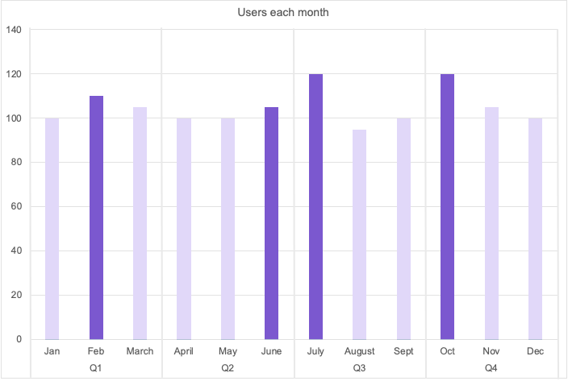

# Quarterly reconciliation and annual true-ups

DETAILS:
**Tier:** Premium, Ultimate
**Offering:** GitLab.com, Self-managed, GitLab Dedicated

In accordance with [the GitLab Subscription Agreement](https://about.gitlab.com/terms/),
GitLab reviews your seat usage and sends you an invoice for any overages.
This review occurs either quarterly (quarterly reconciliation process) or annually (annual true-up process).

## Quarterly reconciliation versus annual true-ups

With **quarterly reconciliation**, you are billed per quarter on a prorated basis for the remaining portion of the subscription term.
You pay for the maximum number of seats you used during the quarter.
You pay less annually, which can result in substantial savings.

With **annual true-up**, you pay the full annual subscription fee for users added at any time during the year.

If you cannot participate in quarterly reconciliation, you can opt out of the process by using a contract amendment,
and default to the annual review.

### Example

For example, in January you purchased an annual license for 100 users, where each extra seat costs $100.
Throughout the year, the number of users fluctuated between 95 and 120.

The following chart illustrates the number of users during the year, per month and quarter.

If you are billed annually:

- During the year, you went over the license by 20 users.
- For the extra seats, you pay $100 x 20 users.
- The annual total cost is $2000.

If you are billed quarterly:

- In Q1 you had 110 users. 10 users over subscription x $25 per user x 3 quarters = $750.
  You now pay a license for 110 users.
- In Q2 you had 105 users. You did not go over 110 users, so you are not charged.
- In Q3 you had 120 users. 10 users over subscription x $25 per user x 1 remaining quarter = $250.
  You now pay a license for 120 users.
- In Q4 you had 120 users. You did not exceed the number of users from Q3, so you are not charged.
  However, even if you exceeded the number you would not be charged, because in Q4 there are no charges for exceeding the number.
- The annual total cost is $1000.

## Quarterly invoicing and payment

At the end of each subscription quarter, GitLab notifies you about overages.
The date you're notified about the overage is not the same as the date you are billed.

1. An email that communicates the [overage seat quantity](gitlab_com/index.md#seats-owed)
and expected invoice amount is sent:

   - On GitLab.com: On the reconciliation date, to group owners.
   - On GitLab self-managed: Six days after the reconciliation date, to administrators.

1. Seven days after the email notification, the subscription is updated to include the additional seats,
and an invoice is generated for a prorated amount.
If a credit card is on file, the payment applies automatically.
Otherwise, you receive an invoice, which is subject to your payment terms.

## Quarterly reconciliation eligibility

You are automatically enrolled in quarterly reconciliation if:

- The credit card you used to purchase your subscription is still linked to your GitLab account.
- You purchased your subscription through an invoice.

You are excluded from quarterly reconciliation if you:

- Purchased your subscription from a reseller or another channel partner.
- Purchased a subscription that is not a 12-month term (includes multi-year and non-standard length subscriptions).
- Purchased your subscription with a purchasing order.
- Are a public sector customer.
- Have an offline environment and used a license file to activate your subscription.
- Are enrolled in a program that provides a free tier such as the GitLab for Education,
GitLab for Open Source Program, or GitLab for Startups.

If you are excluded from quarterly reconciliation and not on a free tier, your true-ups are reconciled annually.

## Troubleshooting

### Failed payment

If your credit card is declined during the reconciliation process, you receive an email with the subject `Action required: Your GitLab subscription failed to reconcile`. To resolve this issue, you must:

1. [Update your payment information](customers_portal.md#change-your-payment-method).
1. [Set your chosen payment method as default](customers_portal.md#set-a-default-payment-method).

When the payment method is updated, reconciliation is retried automatically.
